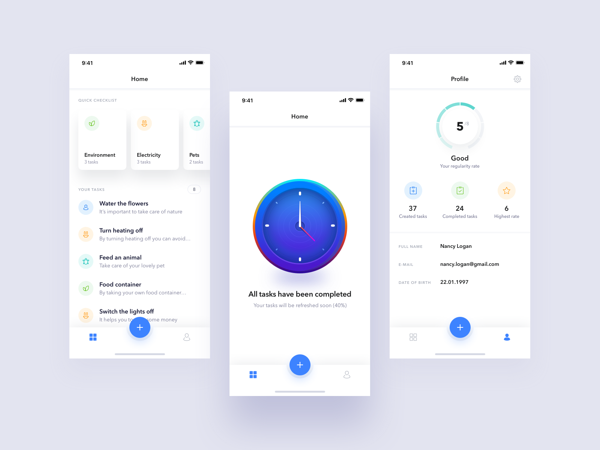
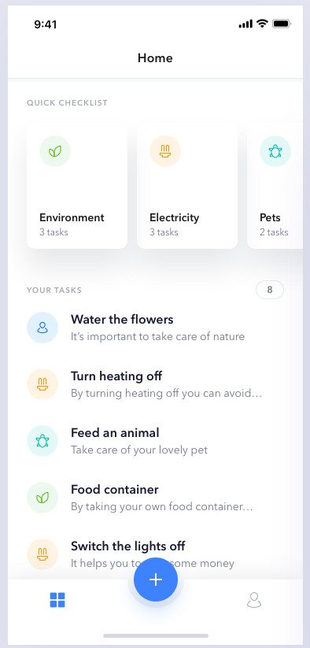

# ShellItemRenderer Sample - Todo App
This sample code is to be used as learning material that goes along with my blog - [Xamarin.Forms Shell: Customizing the TabBar (Android)](https://www.andrewhoefling.com/Blog/Post/xamarin-forms-shell-customizing-the-tabbar-android).

# Design
The app is built to simulate the tab-bar at the bottom of this Todo App Design from Dribble

